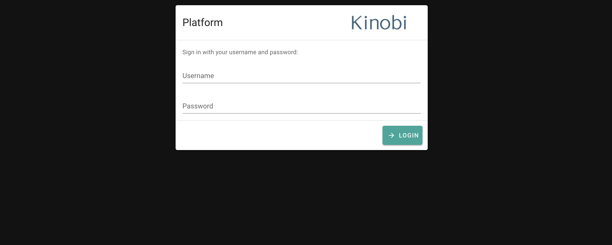

# Kinobi Test
Building a web application that allows user to do file upload

## Screenshots:



## Feature
- Upload file
- View list of upload file

## Built with:
- **NodeJS**: For server side. (Node 10+)
- **NuxtJS**: For client side. (Nuxt 2.15.x)

### Start server
In root folder run follow commands:
```bash
$ cd server
$ npm install
$ npm start
```
Server live on: http://localhost:5000/
Exposed API:
```bash
POST: /auth/login                Login
```
```bash
POST: /auth/logout               Logout
```
```bash
GET: /auth/register              Register a new account
```
```bash
GET: /api/files                  Get files list
```
```bash
GET: /api/files/{name}           Download file
```
```bash
POST: /api/files                 Upload file
```

### Start client
In root folder run follow commands:
```bash
$ npm install
$ npm run dev
```
Client live on: http://localhost:3000/


### Test account
``` admin / 12345678 ```
In this project, I used JWT for authentication. Please checkout `server/.env` file for some configuration.

## 🔨 Build

```bash
npm install
npm run build
npm start
```

## 🖥 Browsers support

Modern browsers and Internet Explorer 10+.

